<p align="center"></p>
<p align="center"></p>
<h3 align="center">Showcase your skills on your GitHub or resumé with ease!</h3>
<hr>

<h3 align="center">Powered by Cloudflare Workers ⚡</h3>

# Docs

- [Example](#example)
- [Specifying Icons](#specifying-icons)
- [Themed Icons](#themed-icons)
- [Centering Icons](#centering-icons)
- [Icons List](#icons-list)

# Example

<p align="center"></p>
<p align="center"></p>

# Specifying Icons

Copy and paste the code block below into your readme to add the skills icon element!

Change the `?i=js,html,css` to a list of your skills seprated by ","s! You can find a full list of icons [here](#icons-list).

```md
[](https://skillicons.dev)
```

[](https://skillicons.dev)

# Themed Icons

Some icons have a dark and light themed background. You can specify which theme you want as a url parameter.

This is optional. The default theme is dark.

Change the `?theme=light` to either `dark` or `light`. The theme is the background color, so light theme has a white icon background, and dark has a black-ish.

**Light Theme Example:**

```md
[](https://skillicons.dev)
```

[](https://skillicons.dev)

# Centering Icons

Want to center the icons in your readme? The SVGs are automatically resized, so you can do it the same way you'd normally center an image.

```html
<p align="center">
  <a href="https://skillicons.dev">
    
  </a>
</p>
```

<p align="center">
  <a href="https://skillicons.dev">
    
  </a>
</p>

# Icons List

Here's a list of all the icons currently supported. Feel free to open an issue to suggest icons to add!

|    Icon ID     |                         Icon                         |
| :------------: | :--------------------------------------------------: |
|      `ae`      |   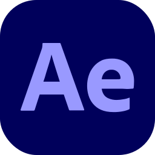    |
|   `angular`    |   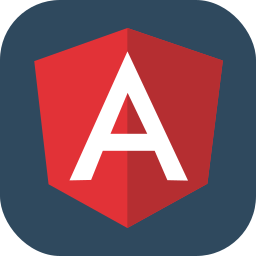    |
|     `bash`     |     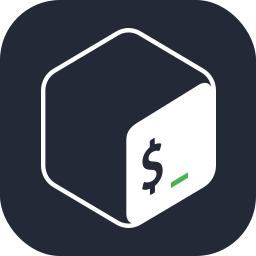     |
|      `c`       |                  |
|      `cs`      |        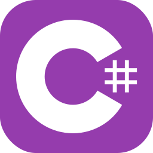         |
|     `cpp`      |        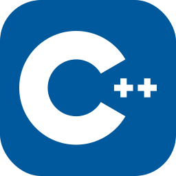        |
|   `clojure`    |   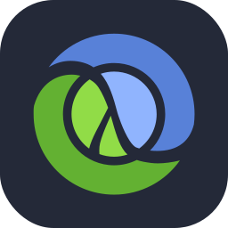    |
|  `cloudflare`  |    |
| `coffeescript` |  |
|     `css`      |                |
|     `dart`     |     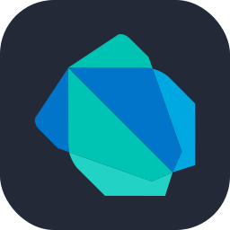     |
|     `deno`     |     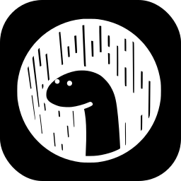     |
|    `docker`    |             |
|    `figma`     |    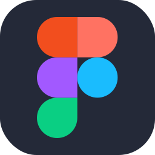     |
|     `git`      |        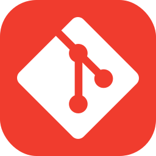        |
|      `go`      |             |
|    `godot`     |         |
|   `grafana`    |       |
|     `haxe`     |          |
|     `html`     |               |
|      `ae`      |    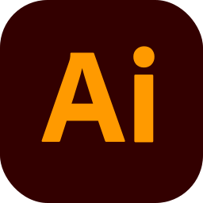    |
|     `java`     |          |
|      `js`      |         |
|   `jenkins`    |       |
|    `jquery`    |             |
|    `kotlin`    |    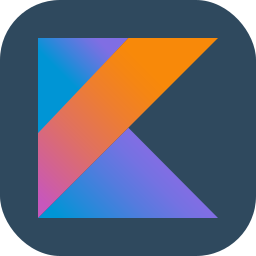    |
|  `kubernetes`  |         |
|    `linux`     |         |
|     `lua`      |           |
|      `md`      |      |
|   `mongodb`    |            |
|    `mysql`     |         |
|    `nextjs`    |    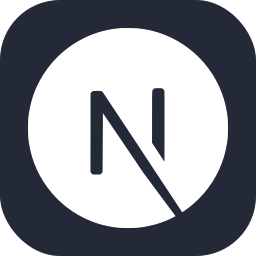    |
|    `nginx`     |              |
|    `nodejs`    |    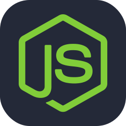    |
|    `nuxtjs`    |    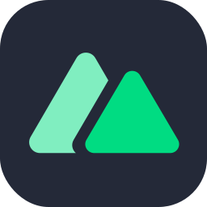    |
|      `ps`      |          |
|     `php`      |           |
|   `postgres`   |    |
|      `pr`      |           |
|    `prisma`    |             |
|  `prometheus`  |         |
|      `py`      |        |
|      `r`       |             |
|    `rails`     |              |
|    `react`     |         |
|    `redis`     |    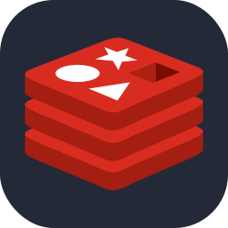     |
|    `regex`     |         |
|    `remix`     |              |
|     `ruby`     |       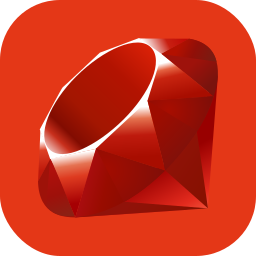        |
|     `rust`     |       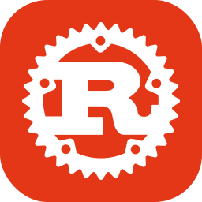        |
|     `sass`     |               |
|   `solidity`   |           |
|    `scala`     |    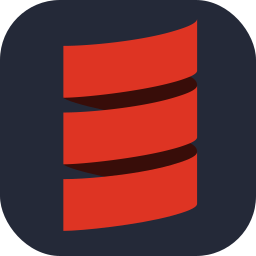     |
|    `svelte`    |             |
|     `svg`      |           |
|    `swift`     |       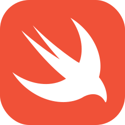       |
|   `tailwind`   |   |
|      `ts`      |         |
|    `unity`     |         |
|     `vim`      |           |
|     `vue`      |         |
|     `wasm`     |        |
|  `wordpress`   |          |
|   `workers`    |       |
|     `zig`      |           |

---

## 💖 Support the Project

Thank you so much already for using my projects! If you want to go a step further and support my open source work, buy me a coffee:

<a href='https://ko-fi.com/Q5Q860KQ2' target='_blank'></a>

To support the project directly, feel free to open issues for icon suggestions, or contribute with a pull request!
